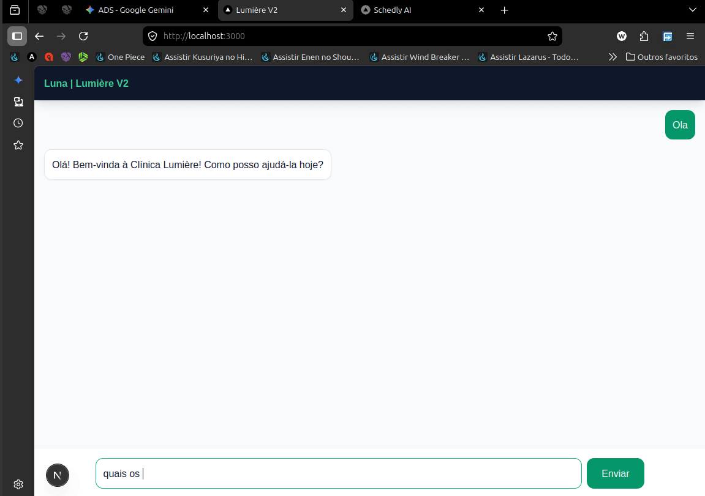

# ✨ Lumière Agentbot: Sua Clínica Nunca Fecha.

Imagine encerrar o expediente com apenas 2 agendamentos para o dia seguinte. 
Você vai dormir, descansa e, enquanto isso, sua clínica continua "viva".

Quando você abre as portas na manhã seguinte e checa o Dashboard, a surpresa: aqueles 2 agendamentos se transformaram em 7.

Esse é o poder do **Lumière Agentbot**. Não é apenas um chatbot; é uma agente virtual autônoma que trabalha 24/7, convertendo conversas em faturamento real enquanto você foca no que realmente importa: seus clientes.

---

## 📸 Demonstração em Tempo Real


---

## 🚀 Experiência Interativa

### 🤖 1. Converse com a Luna
Deseja sentir a experiência do cliente? Agende um serviço agora com nossa IA.
👉 [**Testar Agente Virtual (Vercel)**](https://lumiere-agentbot.vercel.app/)

### 📊 2. Dashboard Administrativo
Veja o agendamento cair em tempo real e gerencie a clínica como a dona do negócio.
👉 [**Acessar Dashboard Lumière**](https://lumiere-ten-vert.vercel.app)

---

## 🔄 Fluxo do Ecossistema
```mermaid
graph LR
    A[Cliente] -->|Linguagem Natural| B(Luna IA - Groq)
    B -->|Validação Semântica| C{Banco de Dados}
    C -->|Slot Disponível| D[Agendamento Confirmado]
    D -->|Push Notification| E[Dashboard Administrativo]
    E -->|Gestão| F[Dona da Clínica]

🛠️ Especificações Técnicas

O projeto foi construído utilizando a Stack Moderna de Alta Performance:

    Frontend: React 18 com Next.js 14 (App Router).

    Inteligência Artificial: SDK Vercel AI com modelo Llama 3 (via Groq API).

    Backend & Banco de Dados: Supabase (PostgreSQL) com Realtime.

    Estilização: Tailwind CSS & Shadcn/UI.

    Infraestrutura: Vercel com Cron Jobs (Keep-alive).

💎 Diferenciais do Projeto

    Extração de Intenção: Converte linguagem natural em dados estruturados (JSON).

    Interface Dark Premium: Design focado no mercado de luxo.

    Resiliência: Sistema de keep-alive para evitar hibernação do banco.

Desenvolvido por Wilcleyber 🚀
